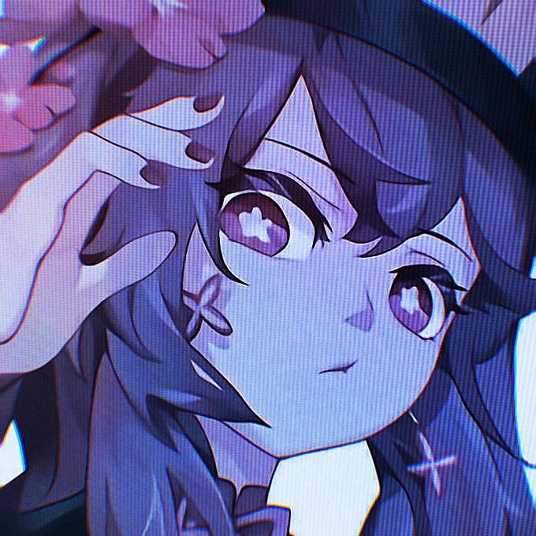

  

<h1 align="center" style="color:#FFD600; font-size:3rem; text-shadow:2px 2px 0 #0a0a0a; letter-spacing:2px;">
  PORTFOLIO.exe
</h1>

  <b>MOH. OFIKURRAHMAN</b>  
  Front-End Web Developer  
  Menciptakan pengalaman web modern, interaktif, dan responsif

  
  
  
  

  

---

## 🚀 Tentang Portfolio

Portfolio ini menampilkan karya, keahlian, dan pengalaman saya sebagai Front-End Web Developer. Dibangun dengan desain modern, animasi interaktif, dan teknologi terbaru untuk memberikan pengalaman web yang elegan dan responsif.

### ✨ Fitur Utama

- **🖥️ Terminal Interaktif (Desktop)**
- **📱 Desain Adaptif (Terminal di Desktop, Profil di Mobile)**
- **Animasi Smooth** (Three.js, GSAP)
- **Dark/Light Mode**
- **Multi-Bahasa (EN/ID)**
- **Formulir Kontak Aktif**
- **Carousel Skills**
- **Proyek Unggulan**

---

## ⌨️ Perintah Terminal (Khusus Desktop)

Salah satu fitur unik dari portofolio ini adalah terminal interaktif. Buka di desktop dan coba beberapa perintah berikut:

| Perintah             | Deskripsi                                 |
| -------------------- | ----------------------------------------- |
| `help`               | Menampilkan semua perintah yang tersedia. |
| `about`              | Navigasi ke bagian "Tentang Saya".        |
| `skills`             | Navigasi ke bagian "Skills".              |
| `projects`           | Navigasi ke bagian "Proyek".              |
| `contact`            | Navigasi ke bagian "Kontak".              |
| `social`             | Menampilkan tautan media sosial.          |
| `cv`                 | Mengunduh CV dalam format PDF.            |
| `theme [dark/light]` | Mengubah tema tampilan.                   |
| `lang [id/en]`       | Mengubah bahasa situs.                    |
| `clear`              | Membersihkan layar terminal.              |

---

## 🛠️ Tech Stack

---

## 🌟 Proyek Unggulan

### 🛒 **E-Commerce Platform**

Platform e-commerce modern dengan React.js & Node.js. Fitur lengkap: keranjang, pembayaran, dashboard admin.

### 🌐 **Portfolio Website**

Website portfolio responsif dengan animasi smooth & desain modern. Skor Lighthouse 95+.

### ✅ **Task Management App**

Aplikasi manajemen tugas dengan drag & drop, real-time update, dan kolaborasi tim.

---

## 📬 Kontak

  
  
  
  

  <b>Terbuka untuk kolaborasi, proyek freelance, atau sekadar diskusi seputar web development!</b> 
  <i>Jangan ragu untuk menghubungi saya melalui platform favorit Anda.</i>

